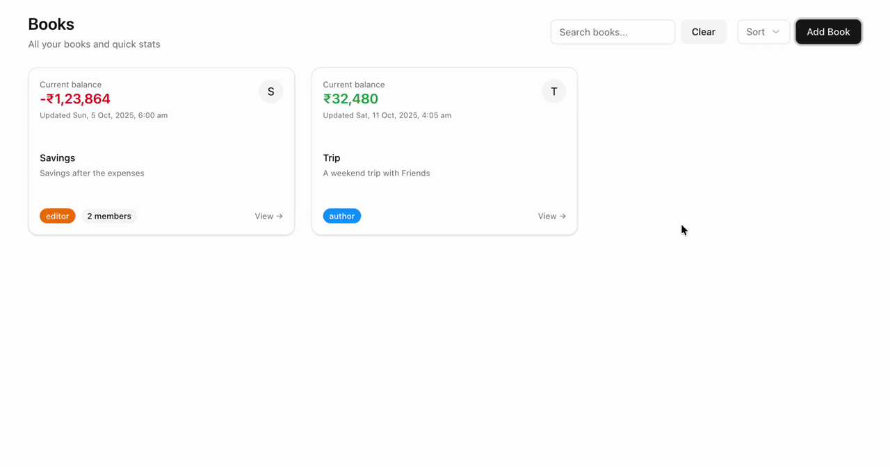

# My Ledger

A modern shared ledger application for tracking finances collaboratively. Built with a monorepo architecture using Turborepo, NestJS, and Next.js.



## Features

### 💰 Transaction Management
- Track credited and debited transactions across multiple **books** (ledgers)
- Bulk import transactions via CSV upload
- Filter by description, amount, date range, category, and payment method
- Customizable **categories** and **payment methods** per book

### 🔗 Easy Sharing
- Invite collaborators via a **shareable invite link** or directly by **email** (handled by Clerk — no manual setup needed)
- Sent invitations are tracked in-app — you can see which invitees have accepted

### 🔒 Security & Privacy with Clerk
- Authentication is powered by [Clerk](https://clerk.com/) — users never share passwords or personal credentials
- Social sign-in supported out of the box (Google, etc.)
- Privacy-first: only a user's name and email are visible to book members

### 🛡️ Role-Based Access Control (RBAC)
- **Author** (Owner): Full control — edit book details, manage members, transfer ownership, delete the book
- **Editor**: Can add, edit, and delete transactions; manage categories and payment methods
- **Viewer**: Read-only access to transactions

## Apps and Packages

| Path | Description |
|------|-------------|
| `apps/web` | [Next.js](https://nextjs.org/) frontend (App Router) |
| `apps/api` | [NestJS](https://nestjs.com/) backend API |
| `packages/@repo/eslint-config` | Shared ESLint configuration |
| `packages/@repo/typescript-config` | Shared TypeScript configuration |

## Tech Stack

- **Frontend**: Next.js (App Router), Shadcn UI, Tailwind CSS
- **Backend**: NestJS, Drizzle ORM, PostgreSQL (Supabase)
- **Auth**: Clerk
- **Monorepo**: Turborepo + pnpm workspaces

## Setup & Development

### Prerequisites

- [Node.js](https://nodejs.org/) (v20 or later)
- [pnpm](https://pnpm.io/)

### Installation

```bash
pnpm install
```

### Environment Variables

Copy the example env files and fill in your values:

```bash
# Backend
cp apps/api/.env.example apps/api/.env

# Frontend
cp apps/web/.env.example apps/web/.env.local
```

Required variables:
- `DATABASE_URL` — PostgreSQL connection string (Supabase recommended)
- `CLERK_SECRET_KEY`, `CLERK_PUBLISHABLE_KEY` — from your Clerk dashboard
- `CLERK_WEBHOOK_SECRET` — for Clerk webhook events

### Running Locally

```bash
pnpm dev
```

### Building

```bash
pnpm build
```
